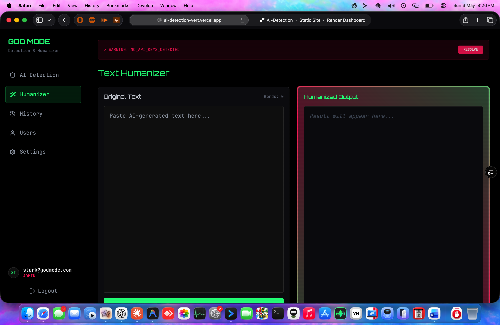

# 🛡️ AI Detection & Humanizer Platform

A high-performance, professional-grade AI Content Detection and Text Humanization platform. Built with a modern **Cyberpunk/Glassmorphism** aesthetic, this tool allows users to verify the authenticity of text and seamlessly convert AI-generated content into natural, human-like writing.



## 🚀 Key Features

-   **🔍 Advanced AI Detection**: 
    -   Real-time analysis with percentage-based scoring.
    -   Confidence levels and detailed verdicts (Likely AI vs Likely Human).
    -   Suspicious pattern identification and sentence-level probability breakdown.
-   **✨ Text Humanizer**: 
    -   "Recode" AI text to bypass detectors while preserving 100% of the original meaning.
    -   Maintains original word count and facts with varied sentence structures.
-   **📂 Multi-Format Support**: Upload and extract text directly from **PDF**, **DOCX**, and **TXT** files.
-   **📊 Visual Analytics**: Interactive circular gauges and data visualizations for scan results.
-   **🔐 Robust Auth System**: Secure Login/Signup with role-based access (Admin/User) and account status management (Approved/Pending/Blocked).
-   **🛠️ Admin God-Mode**:
    -   Full user registry management.
    -   Real-time usage tracking (words scanned).
    -   Granular access control (Lock/Unlock users, Tier upgrades).
-   **⏳ History & Logs**: Complete record of previous scans and humanization tasks for every user.

## 🛠️ Tech Stack

-   **Frontend**: React.js (Vite)
-   **Styling**: Tailwind CSS (Custom Cyberpunk Theme)
-   **Icons**: Lucide React
-   **Charts**: Recharts
-   **Parsing**: PDF.js (PDF extraction), Mammoth.js (Word extraction)
-   **Fonts**: Orbitron (Headings), JetBrains Mono (Content)

## 🤖 AI Core (Multi-Provider Support)

The platform is engine-agnostic and supports multiple high-performance AI backends:
-   **Google Gemini**: Optimized for large context and high-accuracy detection.
-   **Groq**: Ultra-fast inference using Llama 3 models.
-   **NVIDIA NIM**: Enterprise-grade performance for high-scale processing.
-   **Unified Router**: Support for custom base URLs (AgentRouter/OneAPI).

## 📥 Getting Started

### Prerequisites
-   Node.js (v18+)
-   npm or yarn

### Installation
1. Clone the repository:
   ```bash
   git clone <repository-url>
   cd ai-detection
   ```
2. Install dependencies:
   ```bash
   npm install
   ```
3. Run the development server:
   ```bash
   npm run dev
   ```

## ⚙️ Configuration

1. Log in with an admin account (use the secret `GODMODE_ADMIN` code during signup for the first admin).
2. Navigate to **System Settings**.
3. Input your API keys for the desired providers (Gemini, Groq, NVIDIA, etc.).
4. Select the active model and save the configuration.

## 🎨 UI Aesthetics

-   **Glassmorphism**: Translucent panels with backdrop filters.
-   **Cyberpunk Palette**: Deep midnight backgrounds (#0a0a0f) with neon green (#00ff88) and hot pink (#ff3366) accents.
-   **Animated UI**: Pulsing gauges, scanning laser lines, and glowing borders.

---

Built with ❤️ by **StarKBBK**
